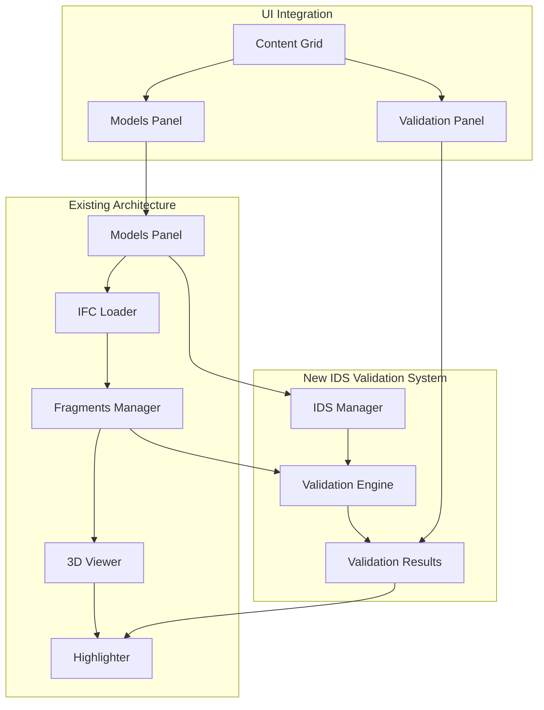

# Design Document

## Overview

The IDS validation functionality will be integrated into the existing BIM viewer application by extending the current component architecture. The design leverages the established patterns of OpenBIM Components (@thatopen/components), BUI templates, and the existing grid layout system. The validation system will add IDS file management, validation execution, and results visualization while maintaining the client-side processing approach and seamless integration with existing 3D viewer capabilities.

## Architecture

### High-Level Architecture

The validation system extends the existing architecture with three main additions:

1. **IDS Management Component** - Handles IDS file loading, parsing, and storage
2. **Validation Engine Component** - Executes validation logic against loaded models
3. **Validation Results UI** - Displays results and integrates with 3D viewer highlighting



### Component Integration

The validation system integrates with existing components:

- **FragmentsManager**: Provides access to loaded IFC model data for validation
- **Highlighter**: Used to visually mark validation failures in the 3D viewer
- **Camera Controls**: Used to focus on failing elements when selected
- **BUI Grid System**: Extended to include validation results panel
- **Models Panel**: Extended to include IDS file loading functionality

## Components and Interfaces

### Built-in IDS Components (Existing)

**@thatopen/components** provides IDS support through:

- **`OBC.IDSSpecifications`**: Component for managing IDS specifications
- **Built-in IDS parsing**: Uses `load()` method to parse IDS XML files
- **Integrated validation**: Uses `spec.test()` method to validate against loaded IFC models
- **Result management**: Returns structured validation results with element IDs and pass/fail status
### IDS Integration Wrapper

**Purpose**: Provides a simplified interface to the existing IDS functionality for UI integration

**Interface**:
```typescript
interface IDSIntegration {
  idsComponent: OBC.IDSSpecifications;
  loadIDSFile(file: File): Promise<void>;
  runValidation(modelIds?: string[]): Promise<void>;
  getValidationResults(): ValidationDisplayResult[];
  highlightFailures(specId: string, requirementId?: string): void;
  clearHighlights(): void;
  exportResults(format: 'json' | 'csv'): Promise<Blob>;
}

interface ValidationDisplayResult {
  specificationId: string;
  specificationName: string;
  modelName: string;
  requirements: RequirementDisplayResult[];
  summary: {
    totalRequirements: number;
    passedRequirements: number;
    failedRequirements: number;
  };
}

interface RequirementDisplayResult {
  id: string;
  name: string;
  status: 'passed' | 'failed';
  failedElements: {
    elementId: string;
    elementType: string;
    reason: string;
  }[];
  passedCount: number;
  failedCount: number;
}
```

**Responsibilities**:
- Wrap the existing OBC.IDSSpecifications component for easier UI integration
- Transform validation results into UI-friendly format
- Coordinate with existing Highlighter component for visual feedback
- Handle file loading and error states for UI consumption
- Provide simplified methods for common validation workflows

### UI State Manager

**Purpose**: Manages UI state and coordinates between built-in IDS components and interface

**Interface**:
```typescript
interface IDSUIStateManager {
  currentResults: ValidationDisplayResult[];
  selectedSpecification?: string;
  selectedRequirement?: string;
  isValidating: boolean;
  
  updateResults(results: ValidationDisplayResult[]): void;
  selectSpecification(specId: string): void;
  selectRequirement(reqId: string): void;
  clearSelection(): void;
  setValidationState(isValidating: boolean): void;
}
```

**Responsibilities**:
- Manage UI state for validation results display
- Coordinate highlighting and camera focusing
- Handle user interactions with validation results
- Maintain selection state for specifications and requirements
- Provide reactive updates to UI components

## Data Models

### Leveraging Built-in IDS Types

The design will use the existing IDS types from @thatopen/components:

```typescript
// These types are already provided by @thatopen/components
// We'll use them directly rather than creating our own

// From OBC.IDSSpecifications component:
// - IDS specification parsing and storage
// - Validation result structures
// - Built-in requirement and applicability types
```

### UI-Specific Data Transformation

We'll create lightweight adapters to transform the built-in results for UI display:

```typescript
interface UIValidationSummary {
  specificationName: string;
  modelName: string;
  totalRequirements: number;
  passedRequirements: number;
  failedRequirements: number;
  validationDate: Date;
}

interface UIFailedElement {
  elementId: string;
  elementType: string;
  displayName: string;
  failureReason: string;
  clickable: boolean; // for UI interaction
}

interface UIRequirementResult {
  id: string;
  displayName: string;
  status: 'passed' | 'failed';
  badge: {
    text: string;
    color: 'green' | 'red';
  };
  failedElements: UIFailedElement[];
  isExpanded: boolean; // for collapsible UI
}
```

## Error Handling

### IDS File Processing Errors

- **Built-in Error Handling**: Leverage the existing error handling from OBC.IDSSpecifications
- **UI Error Display**: Transform component errors into user-friendly messages
- **File Format Validation**: Use built-in IDS validation and display results clearly
- **Graceful Fallbacks**: Handle unsupported IDS features by showing warnings but continuing with supported parts

### Validation Execution Errors

- **Component Error Integration**: Catch and display errors from the built-in validation engine
- **Model Availability**: Check model loading state before attempting validation
- **Progress Feedback**: Use existing component events to show validation progress
- **Resource Management**: Rely on built-in memory management and optimization

### UI Error States

- **Loading States**: Show progress indicators during file processing and validation
- **Error Recovery**: Allow users to retry failed operations without losing other loaded data
- **Graceful Degradation**: Maintain core viewer functionality even if validation features encounter errors

## Testing Strategy

### Unit Testing

**IDS Integration Wrapper Tests**:
- File loading integration with OBC.IDSSpecifications
- Result transformation from built-in format to UI format
- Error handling and user-friendly error messages
- Integration with existing Highlighter component

**UI State Manager Tests**:
- State management for validation results
- Selection handling for specifications and requirements
- UI update triggers and reactive behavior
- Integration with existing BUI component system

**UI Template Tests**:
- Validation panel rendering with mock data
- User interaction handling (clicks, selections)
- Integration with existing grid layout system
- Responsive behavior and accessibility

### Integration Testing

**Built-in Component Integration**:
- OBC.IDSSpecifications integration with existing FragmentsManager
- Built-in validation engine integration with loaded IFC models
- Integration with existing Highlighter for failure visualization
- End-to-end workflow from IDS loading to result display

**UI Integration**:
- Grid layout updates when validation panel is added
- Panel state management and persistence
- Responsive behavior with different screen sizes
- Keyboard navigation and accessibility

### Performance Testing

**Built-in Component Performance**:
- Leverage existing performance optimizations in OBC.IDSSpecifications
- Test UI responsiveness during built-in validation execution
- Monitor memory usage with large models (existing optimization)
- Validate UI update performance with large result sets

**UI Performance**:
- Test result panel rendering with many failed elements
- Validate highlighting performance with existing Highlighter
- Ensure smooth camera transitions when focusing elements
- Test grid layout performance with validation panel added

## Implementation Phases

**Current Status (July 2025)**: Phases 1-4 are complete. IDS validation is fully functional with real validation results. Phase 5 (Polish and Export) is partially complete - JSON export works but CSV export needs UI integration.

### Phase 1: Built-in Component Integration ✓
- Initialize OBC.IDSSpecifications component in main.ts
- Add IDS file loading option to existing Models Panel
- Create IDS Integration Wrapper for simplified UI access
- Test basic IDS file loading and parsing

### Phase 2: Validation Execution ✓
- Implement validation trigger in Models Panel UI
- Create progress feedback during validation execution
- Handle validation results from built-in component
- Add basic error handling and user feedback

### Phase 3: Results UI Implementation ✓
- Create validation results panel UI template
- Add validation results section to content grid layout
- Implement collapsible requirement display
- Add basic result summary and status badges

### Phase 4: 3D Viewer Integration ✓
- Integrate validation results with existing Highlighter
- Add element focusing using existing camera controls
- Implement click-to-focus functionality from results panel
- Add validation-specific highlighting colors

### Phase 5: Polish and Export (Partial)
- Add export functionality leveraging built-in result data (JSON ✓, CSV pending)
- Implement result filtering and search capabilities (pending)
- Add comprehensive error handling and user feedback (pending)
- Performance testing and optimization (pending)